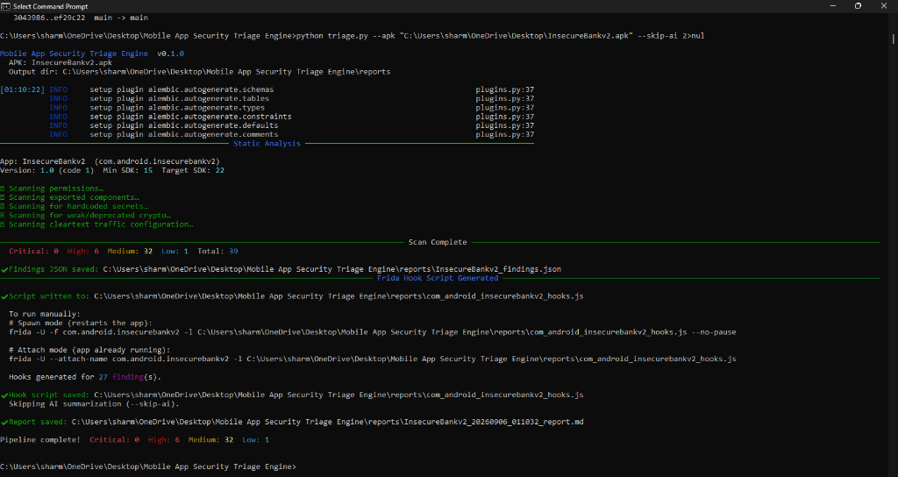

# Mobile App Security Triage Engine

> Automated Android APK security analysis pipeline — static analysis, dynamic hook generation, and AI-powered vulnerability reporting.


---



---

## What It Does

Give it an APK. Get a full security triage report in seconds.

```
python triage.py --apk target_app.apk
```

```
Mobile App Security Triage Engine  v0.1.0
  APK: InsecureBankv2.apk

─────────────────── Static Analysis ───────────────────
App: InsecureBankv2  (com.android.insecurebankv2)
Version: 1.0  |  Min SDK: 15  |  Target SDK: 22

▶ Scanning permissions…
▶ Scanning exported components…
▶ Scanning for hardcoded secrets…
▶ Scanning for weak/deprecated crypto…
▶ Scanning cleartext traffic configuration…

─────────────────── Scan Complete ─────────────────────
  Critical: 0  High: 6  Medium: 32  Low: 1  Total: 39

✔ Findings JSON  →  reports/InsecureBankv2_findings.json
✔ Frida hooks    →  reports/com_android_insecurebankv2_hooks.js
✔ AI Report      →  reports/InsecureBankv2_20260905_184118_report.md

Pipeline complete!
```

---

## Features

| Phase | What it does |
|---|---|
| **Phase 1 — Static Analysis** | Decompiles APK with Androguard; scans for dangerous permissions, unprotected exported components, hardcoded secrets/API keys, weak crypto (MD5, DES, RC4, AES/ECB), and cleartext traffic misconfigurations |
| **Phase 2 — Frida Hook Generator** | Auto-generates Frida JavaScript hook scripts targeting every suspicious class/method found in Phase 1 — ready to attach to a live device |
| **Phase 3 — AI Report** | Sends findings to Google Gemini (free) / Claude / GPT-4 via LangChain; produces a professional Markdown security report with risk scenarios and remediation steps |

---

## Architecture

```
APK File
   │
   ▼
┌─────────────────────────────────┐
│   Phase 1 — Static Analysis     │  ← Androguard 4.x
│                                 │
│  • Permissions audit            │
│  • Exported component scan      │
│  • Hardcoded secrets detection  │
│  • Weak/deprecated crypto       │
│  • Cleartext traffic config     │
└────────────┬────────────────────┘
             │  findings.json
             ▼
┌─────────────────────────────────┐
│   Phase 2 — Hook Generator      │  ← Frida JS templates
│                                 │
│  • 1 hook per suspicious method │
│  • Spawn + attach mode support  │
│  • Ready-to-run frida command   │
└────────────┬────────────────────┘
             │  hooks.js
             ▼
┌─────────────────────────────────┐
│   Phase 3 — AI Summarization    │  ← LangChain + Gemini/Claude/GPT-4
│                                 │
│  • Executive summary            │
│  • Severity-ranked vuln table   │
│  • Real-world exploit scenarios │
│  • Remediation recommendations  │
└─────────────────────────────────┘
             │
             ▼
      Markdown Report
```

---

## Vulnerabilities Detected

- **Dangerous Permissions** — `READ_SMS`, `PROCESS_OUTGOING_CALLS`, `RECORD_AUDIO`, etc.
- **Exported Components** — Activities, Services, Receivers without permission guards
- **Hardcoded Secrets** — API keys, passwords, tokens via regex pattern matching
- **Weak Cryptography** — MD5, DES, RC4, AES/ECB, SHA-1 usage in DEX bytecode
- **Cleartext Traffic** — `android:usesCleartextTraffic`, Network Security Config misconfigs
- **Low Target SDK** — Apps targeting SDK < 28 (Android 9) miss modern security protections

---

## Installation

```bash
git clone https://github.com/skartik06/Mobile-App-Security-Triage-Engine.git
cd Mobile-App-Security-Triage-Engine

pip install -r requirements.txt
pip install langchain-google-genai google-generativeai

cp .env.example .env
# Edit .env and add your free Google Gemini API key
# Get one at: https://aistudio.google.com/apikey
```

---

## Usage

```bash
# Full pipeline (static + hooks + AI report)
python triage.py --apk target.apk

# Skip AI summarization (faster, no API key needed)
python triage.py --apk target.apk --skip-ai

# Custom output directory
python triage.py --apk target.apk --output ./my_reports

# Verbose mode (debug logging)
python triage.py --apk target.apk --verbose
```

---

## Configuration (`.env`)

```env
# LLM Provider: gemini (FREE) | anthropic | openai
LLM_PROVIDER=gemini

# Google Gemini — Free tier
# Get key: https://aistudio.google.com/apikey
GOOGLE_API_KEY=your_key_here
GEMINI_MODEL=gemini-3.6-flash

# Optional: Anthropic Claude
# ANTHROPIC_API_KEY=sk-ant-...
# ANTHROPIC_MODEL=claude-sonnet-4-5

# Optional: OpenAI GPT-4
# OPENAI_API_KEY=sk-...
# OPENAI_MODEL=gpt-4o
```

---

## Output Files

After each run, three files are saved to `reports/`:

| File | Description |
|---|---|
| `{AppName}_findings.json` | Structured JSON — all findings with type, severity, location, evidence |
| `{package_name}_hooks.js` | Frida hook script — attach to live device for dynamic analysis |
| `{AppName}_{timestamp}_report.md` | AI-generated Markdown security report |

### Running the Frida Hooks

```bash
# Spawn mode — restarts the app with hooks attached
frida -U -f com.example.app -l reports/com_example_app_hooks.js --no-pause

# Attach mode — hooks into already-running app
frida -U --attach-name com.example.app -l reports/com_example_app_hooks.js
```

---

## Project Structure

```
Mobile-App-Security-Triage-Engine/
│
├── triage.py            # CLI entry point (Click)
├── static_analysis.py   # Phase 1 — Androguard-based scanner
├── hook_generator.py    # Phase 2 — Frida JS template generator
├── ai_summarizer.py     # Phase 3 — LangChain + LLM report writer
├── utils.py             # Shared: logger, finding schema, JSON helpers
│
├── requirements.txt
├── .env.example
├── .gitignore
└── reports/             # Generated output (gitignored)
```

---

## Tech Stack

| Tool | Purpose |
|---|---|
| [Androguard 4.x](https://github.com/androguard/androguard) | APK parsing, DEX analysis, manifest inspection |
| [Frida](https://frida.re) | Dynamic instrumentation hook script generation |
| [LangChain](https://langchain.com) | LLM abstraction layer |
| [Google Gemini](https://aistudio.google.com) | Free AI report generation |
| [Click](https://click.palletsprojects.com) | CLI framework |
| [Rich](https://rich.readthedocs.io) | Terminal output formatting |

---

## Tested Against

- [InsecureBankv2](https://github.com/dineshshetty/Android-InsecureBankv2) — 39 findings detected
- [DIVA Android](https://github.com/payatu/diva-android) — intentionally vulnerable app

---

## Disclaimer

> This tool is intended for **defensive security research, penetration testing, and educational purposes only**.
> Only analyze APKs you own or have explicit written permission to test.
> The author is not responsible for any misuse.

---

## Author

**Kartik Sharma** — [github.com/skartik06](https://github.com/skartik06)

*Built as a portfolio project demonstrating mobile security research + AI integration skills.*
